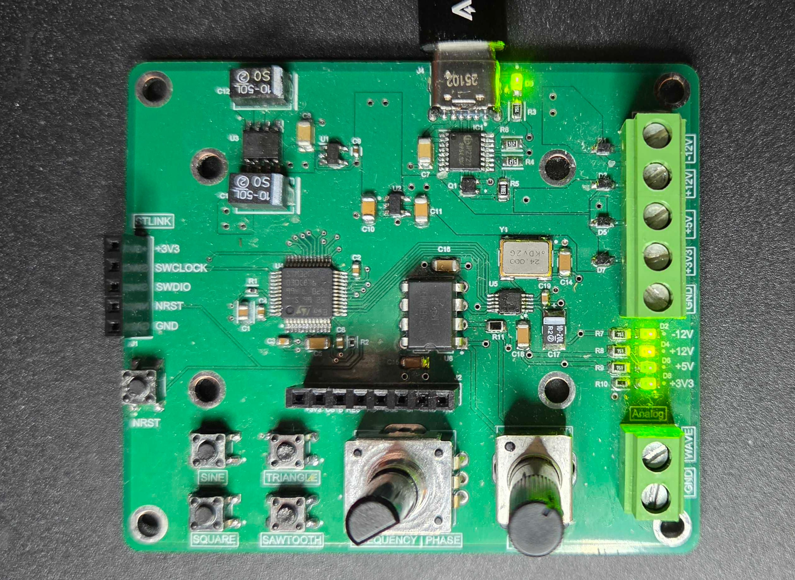
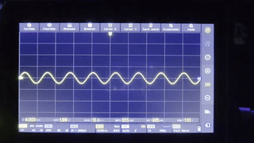
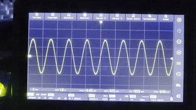
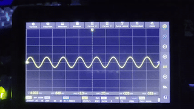
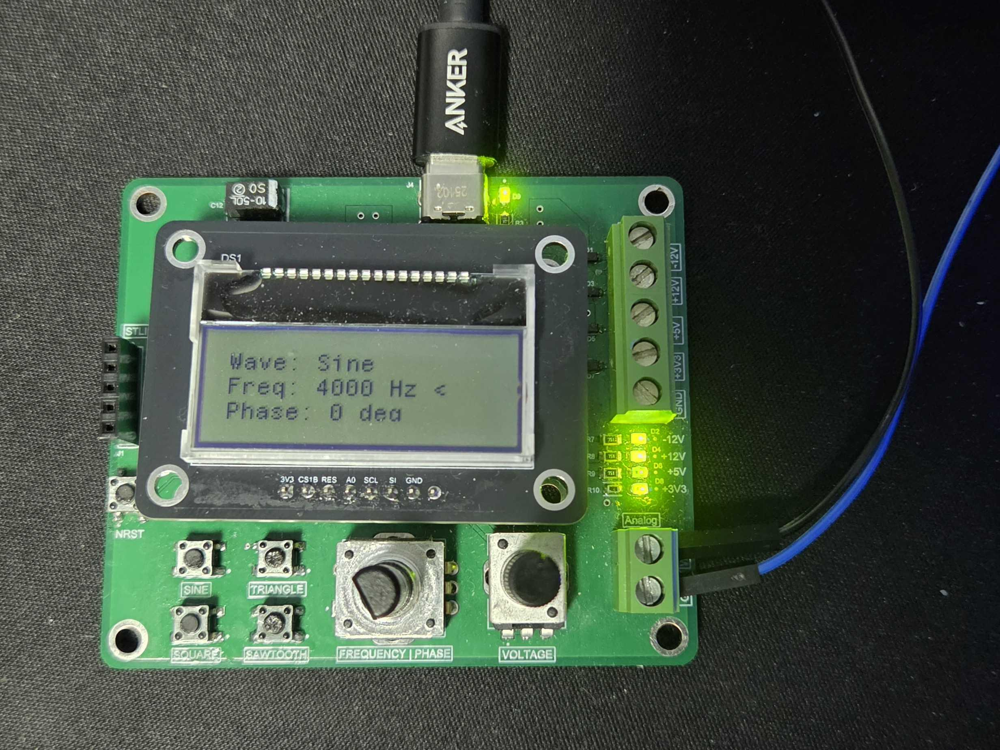
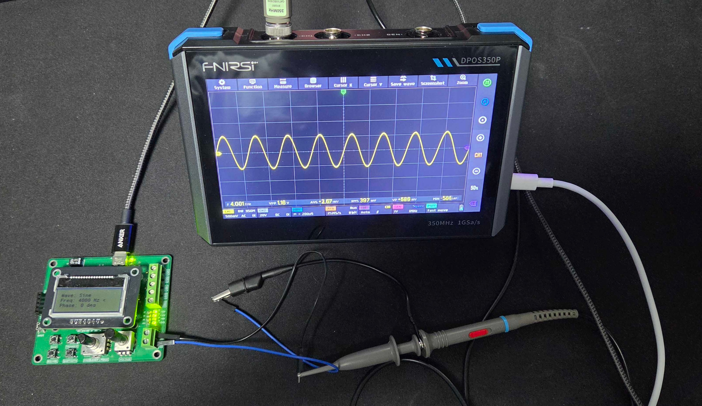

# Waveform-Generator

A power supply and waveform generator PCB.

[View the Schematic and Layout (PDF)](./WAVEFORM_GENERATOR.pdf)

- +12V, -12V, +5V, and +3V3 DC power rails.
- Sine, square, and triangle signal outputs using the AD9833 IC.
- 45 W USB-C input for power delivery using the IP2721 IC.
- Integrated STM32F030C8T6 microcontroller for control.

## Features

### Power Supply

- **Screw Terminals**: +12V, -12V, +5V, and +3V3 DC power rails.
 

 

### Signal Output

- **Waveform**: Toggle between sine, square, and triangle waveforms using the buttons. Note that the Sawtooth wave is unsupported by the AD9833 (oops), so the button toggles a half-frequency square wave instead.
 

 

- **Frequency and Phase**: Control the output frequency and phase using the rotary encoder.
 

 

- **Amplitude**: Tune the output analog voltage amplitude using the potentiometer.
 

 

### System Interface

- **Display**: LCD interface header for real-time waveform and parameter display.
 

 

- **Control**: STM32F030C8T6 microcontroller with an ST-LINK interface header for programming and testing.
 

 

## Source

### Firmware

The firmware is located in the [STM32 Project](./STM32%20Project) folder. It is written in C and uses the STM32 HAL libraries. Interrupts are used for the rotary encoder and buttons.

It can be opened and compiled using [STM32CubeIDE](https://www.st.com/en/development-tools/stm32cubeide.html). To upload the firmware to the device, use an ST-LINK V2, such as the one found on a NUCLEO board, and [STM32CubeProgrammer](https://www.st.com/en/development-tools/stm32cubeprogrammer.html).

### Design Files

The PCB design files are available in the [Altium Files](./Altium%20Files) folder. It is a 4-layer PCB with separate power and signal stages to minimize noise.
